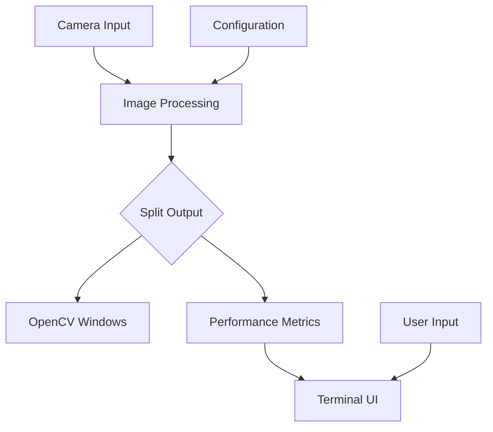
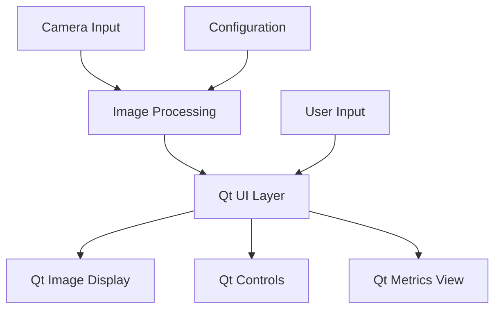

# System Patterns

## Current Architecture
The current MIB-Studio architecture consists of:

- **Core Image Processing Module**: C++ with OpenCV for image manipulation
- **Terminal UI Layer**: FTXUI for displaying metrics and controls in terminal
- **Visualization Layer**: OpenCV's imshow windows for image display
- **Data Management**: JSON-based configuration and data storage

## Design Patterns in Use
- **Observer Pattern**: For updates between processing and UI components
- **Factory Pattern**: For creating different image processing filters
- **Command Pattern**: For handling user inputs and operations
- **Strategy Pattern**: For swappable image processing algorithms

## Component Relationships

## Planned Qt Architecture

## Key Technical Decisions
- Maintain core image processing logic independent of UI framework
- Create abstraction layer between processing and visualization
- Use Qt's Model-View-Controller pattern for UI components
- Leverage Qt's signal-slot mechanism for component communication
- Utilize QThreads for non-blocking UI during image processing

## Migration Approach
- Incremental transition with parallel implementations
- Start with basic Qt window displaying OpenCV outputs
- Gradually replace terminal elements with Qt widgets
- Finally integrate all components into cohesive UI 